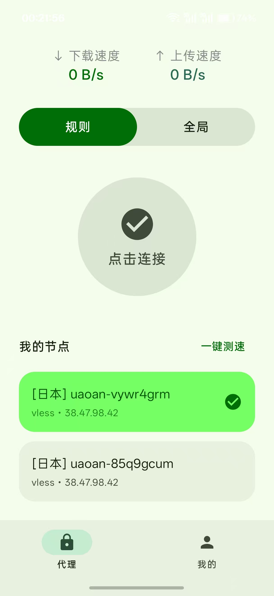
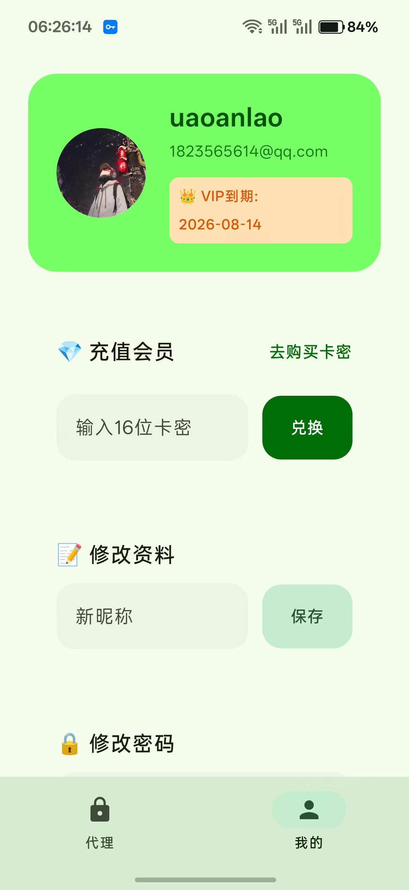
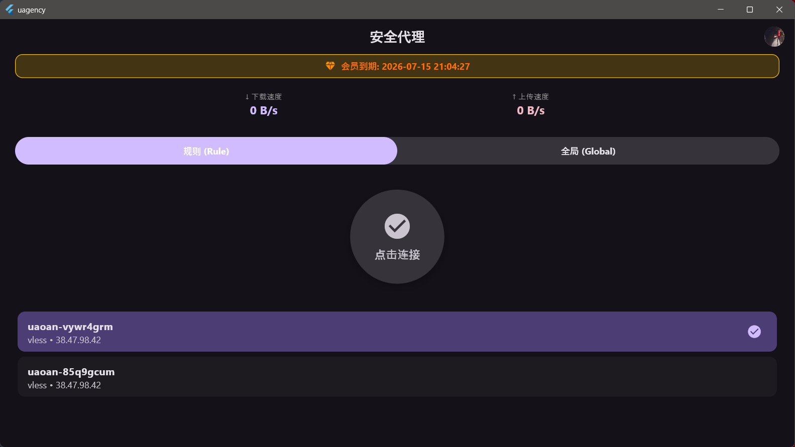
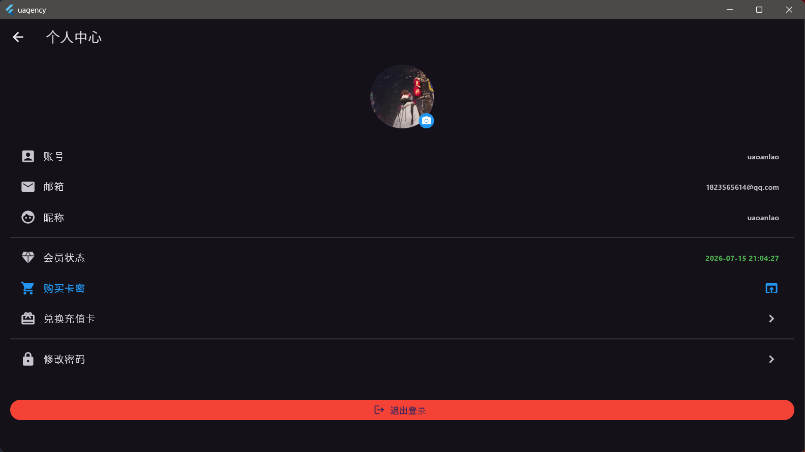
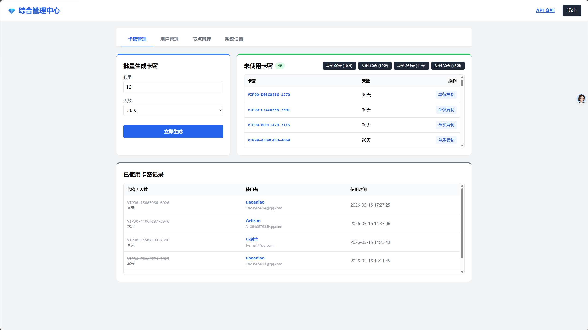
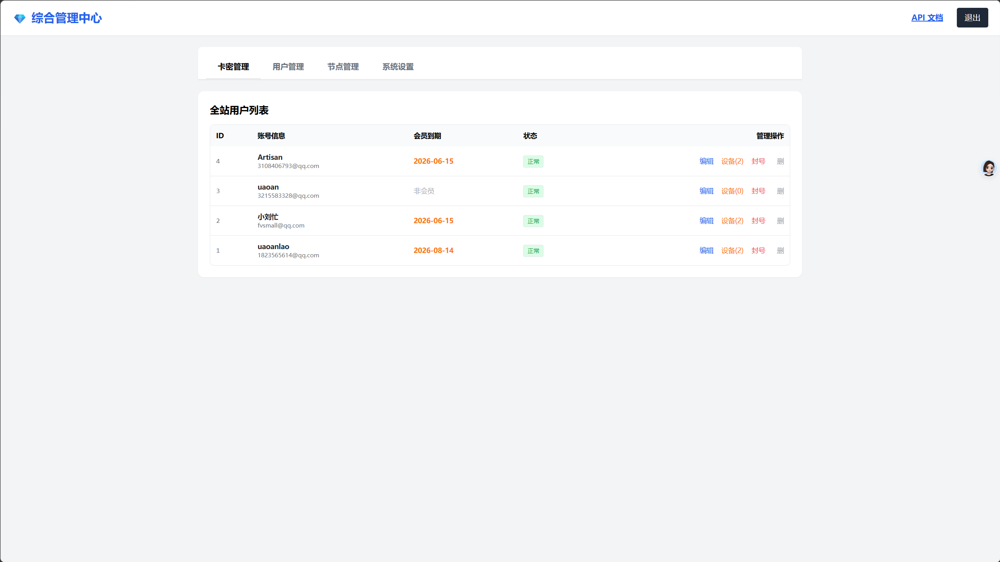
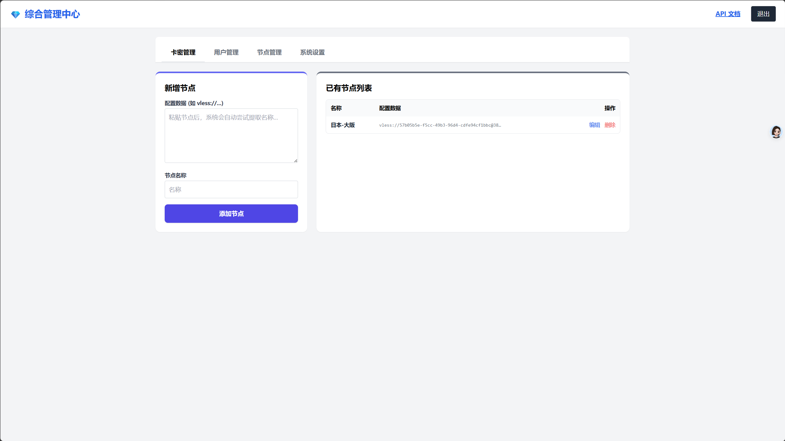

# 🚀 Commercial VPN Proxy Solution Source Code (Android + Windows + Backend)
**[🇺🇸 English](#english-version) | [🇨🇳 中文版](#chinese-version)**

---

## 🇺🇸 English Version

Welcome to the documentation page for our comprehensive, commercial-grade VPN Proxy Solution. We are selling the complete source code for the Android client, Windows desktop client, and the Web-based comprehensive management backend.

This system is fully equipped with a built-in VIP membership and license key (card code) redemption system, ready for fast deployment and monetization.

### 🌟 Key Features

#### 📱 Client Apps (Android & Windows)
* **Modern & Clean UI**: Features a light theme for Android and a sleek dark theme for Windows.
* **Protocol Support**: Deep integration with modern proxy protocols (e.g., **VLESS**).
* **Smart Routing**: One-click toggle between **Rule Mode** and **Global Mode**.
* **Real-time Monitoring**: Live display of download (↓) and upload (↑) speeds.
* **Node Selection**: Easy viewing of current node details (Location, Protocol, IP, Ping) and a smooth node-switching interface.
* **User Center**: 
  * VIP expiration status display.
  * License key / Card code redemption system for automatic VIP activation.
  * Profile modification (nickname, password).

#### ⚙️ Web Admin Dashboard (Comprehensive Management Center)
* **License Key (Card) Management**: Batch generate VIP keys based on quantity and duration (e.g., 30 days, 90 days). Track unused keys and full usage history logs.
* **User Management**: View all registered users, their VIP expiration dates, account status, device limits, and perform management actions (edit, ban, delete).
* **Node Management**: Easily add new server nodes by simply pasting proxy configuration URIs (e.g., `vless://...`). The system auto-parses the data. Edit or delete existing nodes.
* **API Documentation**: Built-in API docs for easy secondary development.

### 📸 Screenshots
*(Replace the URLs with your actual image paths in your repository)*

| Android Client | Windows Client |
| :---: | :---: |
|  |  |
|  |  |

| Web Admin Dashboard |
| :---: |
|  |
|  |
|  |

### 💰 Purchase & Contact
The source code is currently for sale. Upon purchase, you will receive:
1. Android Source Code
2. Windows Source Code
3. Web Backend & API Source Code
4. Deployment instructions and database schemas

**Contact us:**
* Telegram: `[Your Telegram Handle]`
* Email: `[Your Email Address]`

---

## 🇨🇳 中文版

欢迎来到我们的全平台 VPN 代理解决方案源码详情页。我们目前正在出售该套系统的完整源代码，包含：安卓端 App、Windows 桌面端以及 Web 综合管理后台。

该系统内置了完善的 VIP 会员体系和卡密兑换功能，极度适合个人或团队快速部署并实现商业变现。

### 🌟 核心功能特性

#### 📱 客户端 (Android & Windows)
* **现代简约 UI**：安卓端采用清新明亮风格，Windows 端采用极客暗黑主题。
* **底层协议支持**：完美支持当前主流代理协议（如 **VLESS** 等）。
* **智能代理模式**：支持一键切换 **规则模式 (Rule)** 与 **全局模式 (Global)**。
* **实时监控**：首页直观展示实时下载 (↓) 与上传 (↑) 速度。
* **节点管理**：清晰展示当前连接节点信息（地区、协议、IP、延迟 Ping），支持一键更换节点。
* **个人中心**：
  * 直观显示 VIP 到期时间。
  * 内置卡密兑换功能，输入 16 位卡密一键充值/续费会员。
  * 支持修改用户资料（昵称）与账户密码。

#### ⚙️ Web 综合管理后台
* **卡密管理**：支持按天数（如 30天、90天、365天）批量生成激活码；提供未使用卡密列表（支持一键复制）以及详细的已使用记录追踪。
* **用户管理**：全站用户列表一览，实时查看用户 VIP 到期时间、账号状态、在线设备数限制。支持快速编辑、封号、删除等管理操作。
* **节点管理**：极简的新增节点体验，只需粘贴节点配置链接（如 `vless://...`），系统自动提取解析。支持随时编辑和删除已有节点。
* **API 文档**：后台集成了 API 接口文档，方便二次开发与对接。

### 📸 界面截图预览
*（请将图片链接替换为您仓库中实际的图片路径）*

| 安卓客户端 | Windows 客户端 |
| :---: | :---: |
|  |  |
|  |  |

| 综合管理后台 |
| :---: |
|    *卡密生成与管理* |
|    *全站用户管理* |
|    *节点添加与维护* |

### 💰 源码购买与联系方式
本套源码目前公开出售。购买后您将获得：
1. Android 端完整工程源码
2. Windows 端完整工程源码
3. Web 后台管理及后端 API 完整源码
4. 部署文档及数据库文件

**联系方式：**
* Telegram: `[您的 TG 账号]`
* 邮箱: `[您的联系邮箱]`
